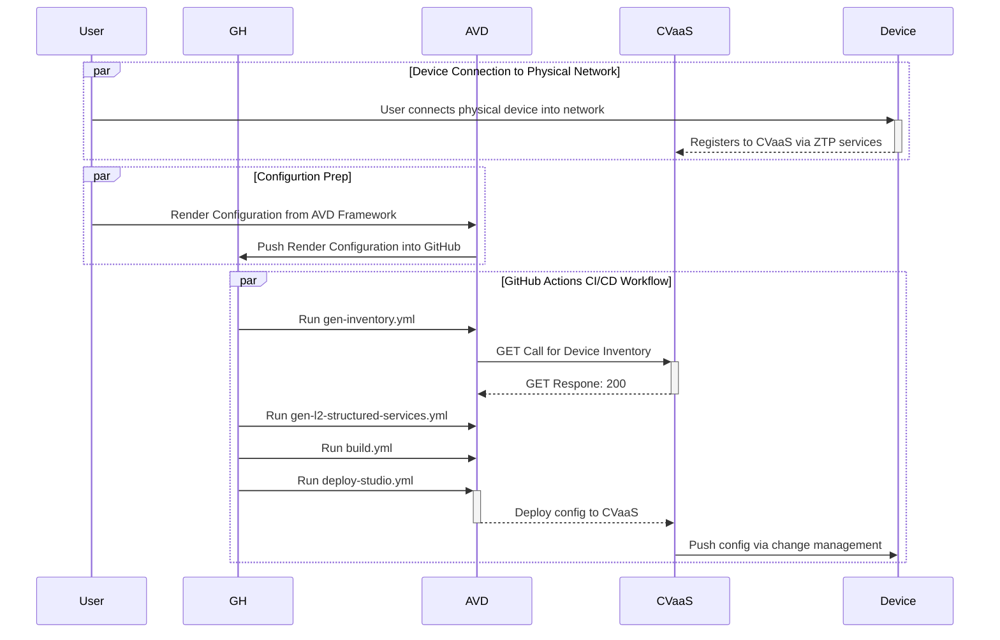

# Campus Deployment & Operations for Modern Networking

## Arista Network Automation - NaaS
FIXME: Update mermaid sequence diagram


## AVD Demo Required Software Version

TODO: create list of required softward versions

* Python 3.12 or Newer

## Clone Git Respository 

Clone down the git repository which contains the lab's working code into a working directory 

FIXME: Update git repo url
```bash
git@github.com:arista-ce-southwest/avd-gns3-ztp-cvaas-demo.git
```

## Access the Python Virtual Environment and Validate AVD Services

TODO: create AVD environ for demo

The python virtual environment should be included when the repository is cloned

Activate the environment and validate the Ansible and AVD componets.

1. activate the virtual environment

```bash
$ source venv/bin/activate
(venv) :~$ 
```