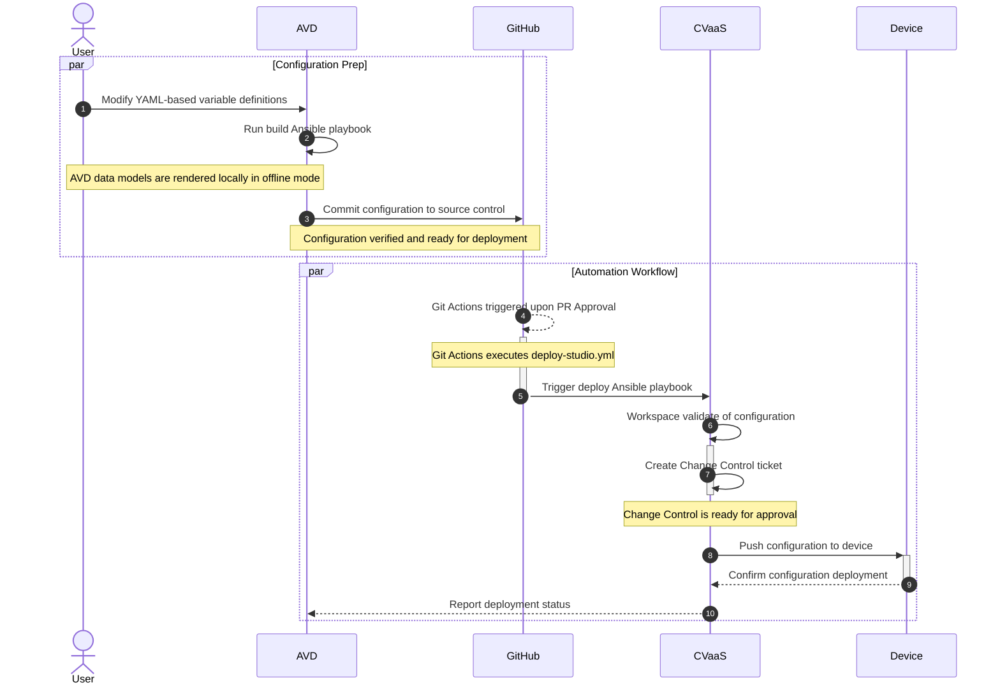
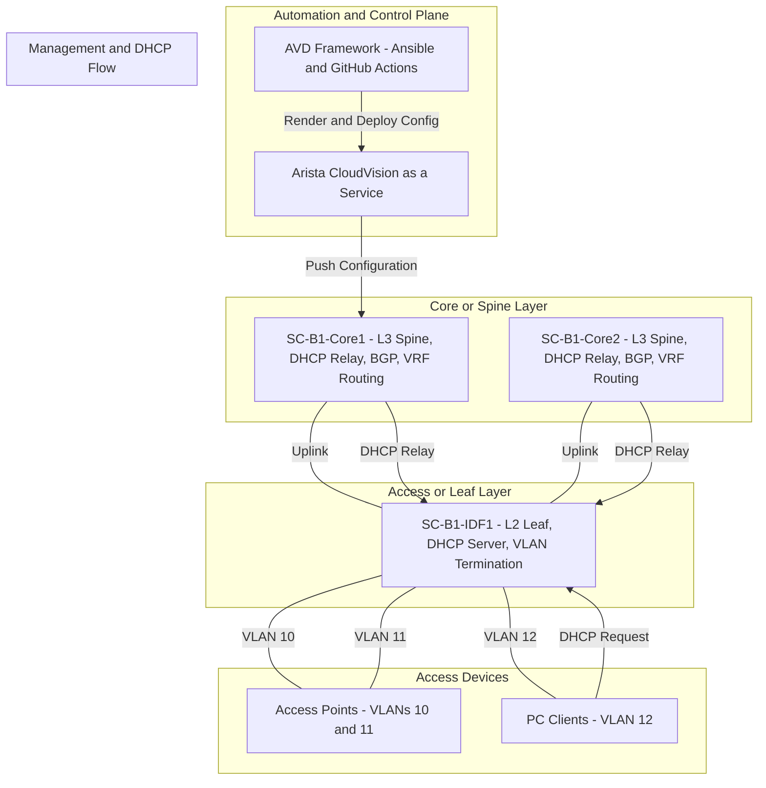

# Campus Deployment & Operations for Modern Networking

## Arista Network Automation - NaaS

This repository contains the full AVD (Arista Validated Design) configuration and automation workflows for a modern campus network deployment demo. The workflow uses CVaaS (CloudVision as a Service), GitHub CI/CD, and Ansible to automate configuration deployment to lab devices.

### Workflow Diagram



## Required Software Versions

Ensure your environment meets the following requirements:

* Python 3.12 or newer
* Ansible 2.14+
* Arista AVD Collection 5.4+
* Python Virtual Environment (venv) for dependency isolation
* Active CVaaS subscription for device orchestration

## Clone Git Respository

Clone the repository into a local working directory:

```bash
git clone git@github.com:arista-ce-southwest/avd-campus-networking-event-demo.git
cd avd-gns3-ztp-cvaas-demo
```

## Setup Python Virtual Environment

Activate the virtual environment included in the repository:

```bash
python3 -m venv venv
source venv/bin/activate
```

Validate that required packages are installed:

```bash
pip install --upgrade pip
pip install -r requirements.txt
ansible --version
```

## Inventory Validation and Service Account Creation in CVP

AVD uses an Ansible inventory to define devices, VRFs, VLANs, and SVIs for the demo network.

1. Validate the inventory structure:

```bash
ansible-inventory -i inventory.yml --graph
ansible-inventory -i inventory.yml --list
```

2. Create a service account in CloudVision (CVaaS):

[Steps to create service accounts on CloudVision - AVD==5.4](https://avd.arista.com/5.4/ansible_collections/arista/avd/roles/cv_deploy/index.html#steps-to-create-service-accounts-on-cloudvision)

## Rendering and Deploying Configurations

AVD renders configuration in structured format before deployment:

1. Run the build playbook:

```bash
ansible-playbook -i inventory.yml build.yml
```

2. Deploy rendered configurations to CVaaS Studios:

```bash
ansible-playbook -i inventory.yml deploy-studio.yml
```

## Topology Overview

The demo topology includes:

* L2 Leaf: SC-B1-IDF1 (inband management VLAN 10, DHCP server endpoint)
* L3 Spine/Core: SC-B1-Core1 / SC-B1-Core2 (DHCP relay, BGP peering, SVI routing)
* Access Devices: APs and PCs connected via VLANs 10, 11, and 12



**Key Highlights:**

* AVD serves as the automation source for configuration generation.
* CVaaS is the central deployment and orchestration platform.
* Core switches provide L3 services and DHCP relay.
* Access devices (APs and PCs) connect through VLANs defined in the demo fabric

## References

* [Arista AVD Documentation](https://avd.arista.com/)
* [CloudVision as a Service](https://www.arista.com/en/products/cloudvision)
* [Ansible EOS Collection](https://docs.ansible.com/ansible/latest/collections/arista/eos/index.html)
* [MermaidJS Diagrams](https://mermaid.js.org/)
