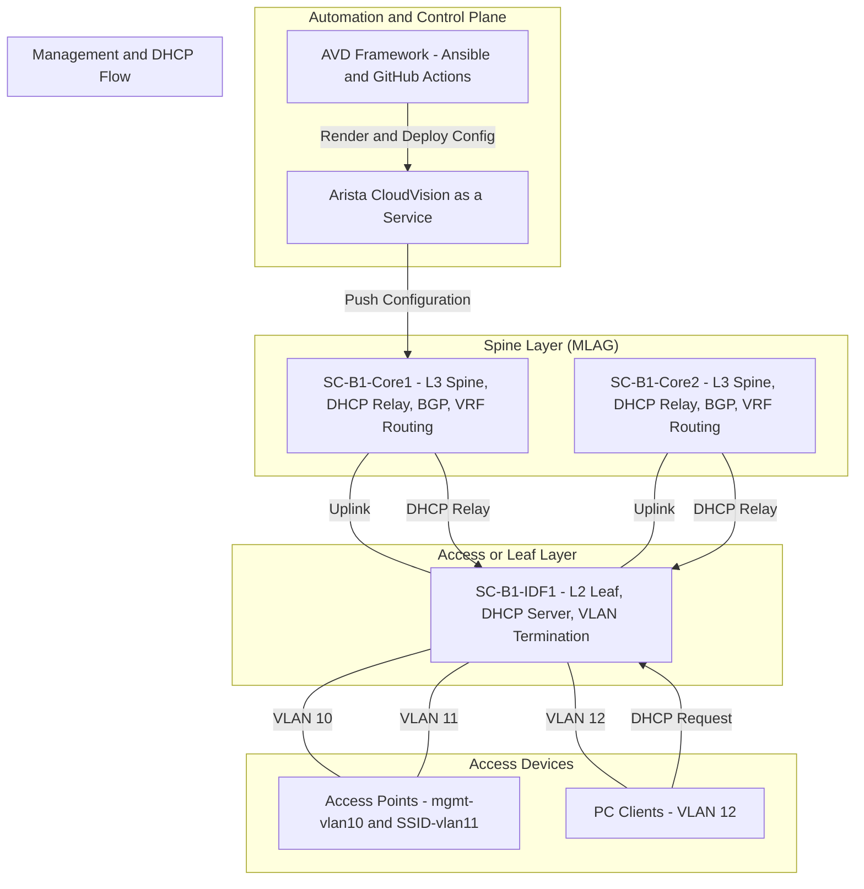

# Topology Overview

The demo topology includes:

- L2 Leaf: SC-B1-IDF1 (inband management VLAN 10, DHCP server endpoint)
- L3 Spine/Core: SC-B1-Core1 / SC-B1-Core2 (DHCP relay, BGP peering, SVI routing)
- Access Devices: APs and PCs connected via VLANs 10, 11, and 12

**Key Highlights:**

- AVD serves as the automation source for configuration generation.
- CVaaS is the central deployment and orchestration platform.
- Core switches provide L3 services and DHCP relay.
- Access devices (APs and PCs) connect through VLANs defined in the demo fabric
