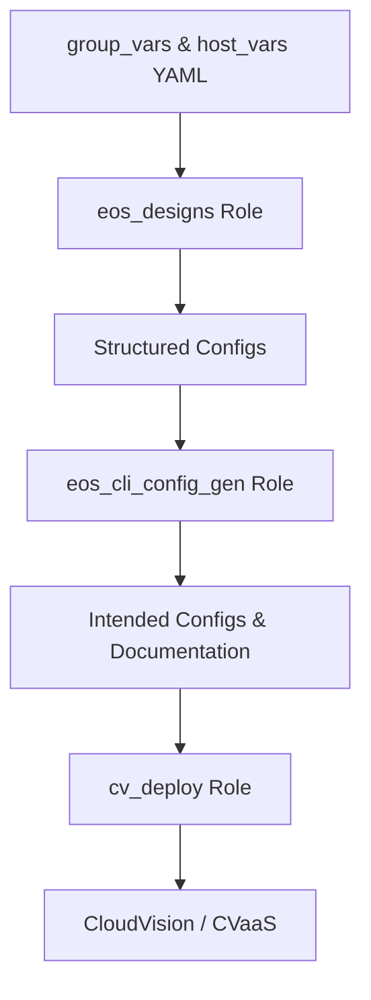

# AVD Variables and Data Model

The Arista Validated Designs (AVD) framework relies on YAML-based variable definitions to describe every aspect of the network, from topology and addressing to features such as VLANs, VRFs, and BGP EVPN. The AVD data model also includes endpoint configuration and port profile definitions.

These variables are organized primarily under the **`group_vars/`** and **`host_vars/`** directories and serve as the source of truth for configuration generation.

---

## Directory Overview

The directory structure below outlines how the AVD demo environment organizes **group variables** and **host variables**.  
Each file defines YAML data consumed by the AVD roles (`eos_designs` and `eos_cli_config_gen`) during configuration generation.

```bash
project_root/
├── group_vars/                      # Variables applied to device groups
│   ├── CAMPUS.yml                   # Global settings applied to all devices (e.g., NTP, logging, VLANs)
│   ├── BD1.yml                      # Campus build-specific settings (e.g., MLAG, uplinks, downlinks, IP address pools)
│   ├── SPINES.yml                   # Defines Layer-3 spine node type and related routing policies
│   ├── LEAVES.yml                   # Defines Layer-2 leaf node type and access layer parameters
│   ├── NETWORK_SERVICES.yml         # Routing, SVI, and VRF configuration variables
│   ├── NETWORK_PORTS.yml            # Endpoint interface definitions using port profiles
│
├── host_vars/                       # Device-specific configuration variables
│   ├── SC-B1-Core1.yml
│   ├── SC-B1-Core2.yml
│   ├── SC-B1-IDF1.yml               # DHCP data models are set here to enable services
│
```

- **`group_vars/`** define data shared by a set of devices or roles (e.g., all spines or all leafs).  
- **`host_vars/`** contain host-specific overrides or unique attributes for a single device.

---

## Variable Hierarchy

When playbooks are executed, Ansible merges variables in this precedence order:

1. **Inventory host_vars**
2. **Inventory group_vars**
3. **Role defaults and vars**
4. **Playbook vars**
5. **Extra vars (highest precedence)**

AVD relies primarily on `group_vars` and `host_vars` as its declarative source.  
These YAML files are consumed by the AVD roles, converted into structured data models, and rendered into both **structured configurations (`structured_configs/`)** and **device configurations (`intended/configs/`)**.

---

## Group Variables (`group_vars/`)

Group variable files define data that applies to multiple hosts or logical device groups.

examples:

<!-- #TODO: ADD Linked content tabs ofr group_vars -->

These files often map directly to Jinja2 templates in the eos_designs role, defining how underlay and overlay protocols are generated.

Host Variables (`host_vars/`)

Host variables define unique, per-device attributes:

<!-- #TODO: ADD Linked content tabs ofr host_vars -->

Host-specific data drives individual interface naming, BGP neighbor creation, and device-specific VLAN/SVI mappings.

---

## Interaction with AVD Roles

`arista.avd.eos_designs`

- Parses and validates all variable inputs from group_vars/ and host_vars/.
- Builds the structured data model under structured_configs/.
- Handles logic such as addressing, VLAN segmentation, and routing topology.

`arista.avd.eos_cli_config_gen`

- Consumes the structured data model.
- Renders the final EOS CLI configuration into intended/configs/.
- Generates Markdown documentation under documentation/ for both fabric and device views.

`arista.avd.cv_deploy`

- Pushes the generated configurations to CloudVision.
- Optionally triggers Change Control workflows or Studio updates.

---

## Example Variable Flow



This flow illustrates how YAML variables defined in inventory directories progress through the AVD pipeline.

---

## Best Practices

:white_check_mark: Keep data modular – use separate group files for fabric, spines, and leafs.  
:white_check_mark: Minimize duplication – define common data once in group_vars.  
:white_check_mark: Validate with `ansible-playbook --syntax-check` to catch YAML formatting errors.  
:white_check_mark: Leverage `avd_facts` to review the structured data model before deployment.  
:white_check_mark: Use version control to track variable and configuration changes.

The `group_vars/` and `host_vars/` directories form the foundation of AVD automation, translating human-readable YAML into consistent, validated, and deployable EOS configurations.
By structuring your data hierarchically and following AVD conventions, you ensure scalability, readability, and alignment with Arista’s declarative automation model.

---

## References

### Getting Started

- [Intro to Ansible and AVD](https://avd.arista.com/5.4/docs/getting-started/intro-to-ansible-and-avd.html)
- [Input Variables](https://avd.arista.com/5.4/ansible_collections/arista/avd/roles/eos_designs/index.html#input-variables)
- [Campus Fabric Example](https://avd.arista.com/5.4/ansible_collections/arista/avd/examples/campus-fabric/index.html)

### Related AVD Roles

- [eos_designs](https://avd.arista.com/5.4/ansible_collections/arista/avd/roles/eos_designs/index.html) – Generates structured configs and fabric documentation.
- [eos_cli_config_gen](https://avd.arista.com/5.4/ansible_collections/arista/avd/roles/eos_cli_config_gen/index.html) – Converts structured configs to EOS CLI configurations.
- [cv_deploy](https://avd.arista.com/5.4/ansible_collections/arista/avd/roles/cv_deploy/index.html) – Pushes configurations to CVaaS Studio.

### Additional Resources

- [Arista AVD Documentation](https://avd.arista.com/5.4/index.html) – Comprehensive AVD reference.
- [Arista ANTA Framework](https://anta.arista.com/stable/) – Automated Network Test Automation framework.
- [Arista PyAVD](https://avd.arista.com/5.4/docs/pyavd/pyavd.html) – Python library for generating AVD structured data.
