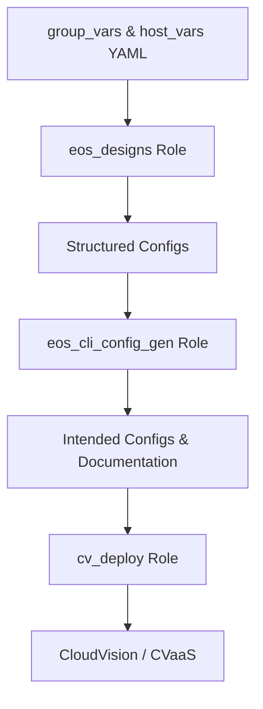

# AVD Variables and Data Model

The Arista Validated Designs (AVD) framework relies on YAML-based variable definitions to describe every aspect of the network, from topology and addressing to features such as VLANs, VRFs, and BGP EVPN. The AVD data model also includes endpoint configuration and port profile definitions.

These variables are organized primarily under the **`group_vars/`** and **`host_vars/`** directories and serve as the source of truth for configuration generation.

---

## Directory Overview

The directory structure below outlines how the AVD demo environment organizes **group variables** and **host variables**.  
Each file defines YAML data consumed by the AVD roles (`eos_designs` and `eos_cli_config_gen`) during configuration generation.

```bash
project_root/
├── group_vars/                      # Variables applied to device groups
│   ├── CAMPUS.yml                   # Global settings applied to all devices (e.g., NTP, logging, VLANs)
│   ├── BD1.yml                      # Campus build-specific settings (e.g., MLAG, uplinks, downlinks, IP address pools)
│   ├── SPINES.yml                   # Defines Layer-3 spine node type and related routing policies
│   ├── LEAVES.yml                   # Defines Layer-2 leaf node type and access layer parameters
│   ├── NETWORK_SERVICES.yml         # Routing, SVI, and VRF configuration variables
│   ├── NETWORK_PORTS.yml            # Endpoint interface definitions using port profiles
│
├── host_vars/                       # Device-specific configuration variables
│   ├── SC-B1-Core1.yml
│   ├── SC-B1-Core2.yml
│   ├── SC-B1-IDF1.yml               # DHCP data models are set here to enable services
│
```

- **`group_vars/`** define data shared by a set of devices or roles (e.g., all spines or all leafs).  
- **`host_vars/`** contain host-specific overrides or unique attributes for a single device.

---

## Variable Hierarchy

When playbooks are executed, Ansible merges variables in this precedence order:

1. **Inventory host_vars**
2. **Inventory group_vars**
3. **Role defaults and vars**
4. **Playbook vars**
5. **Extra vars (highest precedence)**

AVD relies primarily on `group_vars` and `host_vars` as its declarative source.  
These YAML files are consumed by the AVD roles, converted into structured data models, and rendered into both **structured configurations (`structured_configs/`)** and **device configurations (`intended/configs/`)**.

---

## Group Variables (`group_vars/`)

Group variable files define data that applies to multiple hosts or logical device groups.

Explore the YAML variables for each device group:

=== "CAMPUS.yml"

    ```yaml
    ---
    ### Campus Fabric Data Structure
    fabric_name: CAMPUS

    # OOB Management network default gateway.
    mgmt_gateway: null
    mgmt_interface: null
    mgmt_interface_vrf: default

    # local users
    local_users:
    - name: admin
        privilege: 15
        role: network-admin
        sha512_password: "$6$eucN5ngreuExDgwS$xnD7T8jO..GBDX0DUlp.hn.W7yW94xTjSanqgaQGBzPIhDAsyAl9N4oScHvOMvf07uVBFI4mKMxwdVEUVKgY/."

    # AAA Authorization
    aaa_authorization:
    exec:
        default: local

    # dns servers.
    name_servers:
    - 8.8.4.4
    - 8.8.8.8

    # NTP Servers IP or DNS name, first NTP server will be preferred, and sourced from Management VRF
    ntp_settings:
    server_vrf: default
    servers:
        - name: time.google.com
        - name: pool.ntp.org

    # CloudVision Portal definitions
    # Set Inventory for CloudVision host.
    cv_inventory_hostname: "cvaas"
    cvp_instance_ips:
    - apiserver.arista.io
    terminattr_smashexcludes: "ale,flexCounter,hardware,kni,pulse,strata"
    terminattr_ingestexclude: "/Sysdb/cell/1/agent,/Sysdb/cell/2/agent"
    terminattr_disable_aaa: true
    terminattr_cvaddr: "apiserver.arista.io:443"
    terminattr_cvauth: "token-secure,/tmp/cv-onboarding-token"
    # terminattr_cvvrf: MGMT # VRF Management
    terminattr_taillogs: true

    ```

=== "BD1.yml"

    ```yaml
    ---
    ### Building Fabric Data Structure
    ### Here is where physical switch-to-switch connection scaffolding is contructured

    # Spine Switches
    l3spine:
    defaults:
        platform: 710P
        spanning_tree_mode: mstp
        spanning_tree_priority: 4096
        loopback_ipv4_pool: 172.16.0.0/24
        mlag_peer_ipv4_pool: 169.254.0.0/24
        mlag_peer_l3_ipv4_pool: 172.61.1.0/24
        virtual_router_mac_address: 00:1c:73:00:dc:01
        mlag_interfaces: [Ethernet1, Ethernet2]
        bgp_as: 65200
    node_groups:
        - group: SPINES
        nodes:
            - name: SC-B1-Core1
            id: 1
            inband_mgmt_ip: 10.10.0.21/24
            - name: SC-B1-Core2
            id: 2
            inband_mgmt_ip: 10.10.0.22/24

    # IDF - Leaf Switches
    l2leaf:
    defaults:
        platform: 710P
        spanning_tree_mode: mstp
        spanning_tree_priority: 16384
        mlag_peer_ipv4_pool: 169.254.0.0/24
        inband_mgmt_subnet: 10.10.0.0/24
        inband_mgmt_vlan: 10
    node_groups:
        - group: IDF1
        mlag: false
        uplink_interfaces: [Ethernet1,Ethernet2]
        filter:
            tags: [ "10", "11", "12" ]
        nodes:
            - name: SC-B1-IDF1
            id: 3
            inband_mgmt_ip: 10.10.0.10/24
            uplink_switches: [SC-B1-Core1,SC-B1-Core2]
            uplink_switch_interfaces: [Ethernet4]

    ```

=== "SPINES.yml"

    ```yaml
    ---
    ### group_vars/SPINES.yml

    type: l3spine     # Must be either spine|l3spine
    ```

=== "LEAVES.yml"

    ```yaml
    ---
    ### group_vars/LEAVES.yml

    type: l2leaf     # Must be l2leaf
    ```

=== "NETWORK_SERVICES.yml"

    ```yaml
    ---
    ### group_vars/NETWORK_SERVICES.yml
    ### Here is where Network logic is structured such as VARP and dynamoc routing

    # Campus routing 
    underlay_routing_protocol: ebgp

    tenants:
    - name: CAMPUS
        vrfs:
        - name: default
            l3_interfaces:
            - interfaces: [ Ethernet3 ]
                ip_addresses: [ 10.0.1.2/30 ]
                nodes: [ SC-B1-Core1 ]
                description: Firewall Peering
                enabled: true
            - interfaces: [ Ethernet3 ]
                ip_addresses: [ 10.0.2.2/30 ]
                nodes: [ SC-B1-Core2 ]
                description: Firewall Peering
                enabled: true
            bgp_peer_groups:
            - name: FIREWALL
                remote_as: 65100
                send_community: all
                maximum_routes: 0
            bgp_peers:
            - ip_address: 10.0.1.1
                peer_group: FIREWALL
                nodes: [ SC-B1-Core1 ]
            - ip_address: 10.0.2.1
                peer_group: FIREWALL
                nodes: [ SC-B1-Core2 ]
            svis:
            - id: 10
                name: 'Inband_Management_Network'
                tags: ["10"]
                enabled: true
                ip_virtual_router_addresses:
                - 10.10.0.1
                ip_helpers:
                - ip_helper: 10.10.0.10
                nodes:
                - node: SC-B1-Core1
                    ip_address: 10.10.0.21/24
                - node: SC-B1-Core2
                    ip_address: 10.10.0.22/24
            - id: 11
                name: 'WLAN'
                tags: ["11"]
                enabled: true
                ip_virtual_router_addresses:
                - 10.11.0.1
                ip_helpers:
                - ip_helper: 10.10.0.6
                nodes:
                - node: SC-B1-Core1
                    ip_address: 10.11.0.21/24
                - node: SC-B1-Core2
                    ip_address: 10.11.0.22/24
            - id: 12
                name: 'PC'
                tags: ["12"]
                enabled: true
                ip_virtual_router_addresses:
                - 10.12.0.1
                ip_helpers:
                - ip_helper: 10.10.0.10
                nodes:
                - node: SC-B1-Core1
                    ip_address: 10.12.0.21/24
                - node: SC-B1-Core2
                    ip_address: 10.12.0.22/24
    ```

=== "NETWORK_PORTS.yml"

    ```yaml
    ---
    ### group_vars/NETWORK_PORTS.yml
    ### This construct contains the port profiles and other port data structures need to render port 
    ### specific configuration and apply to individual or range of interfaces.

    port_profiles:
    - profile: PC-PROFILE
        mode: "access"
        spanning_tree_portfast: edge
        spanning_tree_bpduguard: enabled
        native_vlan: 1
        vlans: 12
    - profile: AP-PROFILE
        mode: "trunk"
        native_vlan: 10
        vlans: 10,11

    # ---------------- IDF1 ----------------
    network_ports:
    - switches:
        - SC-B\d+-IDF(\d+) # regex match LEAF1A & LEAF1B
        switch_ports:
        - Ethernet10-16
        description: PC
        profile: PC-PROFILE
    - switches:
        - SC-B\d+-IDF(\d+) # regex match LEAF1A & LEAF1B
        switch_ports:
        - Ethernet3-9
        description: AP
        profile: AP-PROFILE
    ```

These files often map directly to Jinja2 templates in the eos_designs role, defining how underlay and overlay protocols are generated.

Host Variables (`host_vars/`)

Host variables define unique, per-device attributes:

<!-- #TODO: ADD Linked content tabs ofr host_vars -->

=== "SC-B1-Core1.yml"

    ```yaml
    custom_structured_configuration_vlan_interfaces:
      - name: Vlan4093
        mtu: null
      - name: Vlan4094
        mtu: null
    ```

=== "SC-B1-Core2.yml"

    ```yaml
    custom_structured_configuration_vlan_interfaces:
      - name: Vlan4093
        mtu: null
      - name: Vlan4094
        mtu: null
    ```

=== "SC-B1-IDF1.yml"

    ```yaml
    ---
    ### Host Specific data structure
    ### This switch host houses the DHCP Server for the topology

    dhcp_servers:
    - disabled: false
        vrf: default
        subnets:
        - subnet: 10.10.0.0/24
            name: Management
            default_gateway: 10.10.0.1
            dns_servers:
            - 8.8.8.8
            ranges:
            - start: 10.10.0.5
                end: 10.10.0.20
        - subnet: 10.11.0.0/24
            name: WLAN
            default_gateway: 10.11.0.1
            dns_servers:
            - 8.8.8.8
            ranges:
            - start: 10.11.0.5
                end: 10.11.0.20
        - subnet: 10.12.0.0/24
            name: PC
            default_gateway: 10.12.0.1
            dns_servers:
            - 8.8.8.8
            ranges:
            - start: 10.12.0.5
                end: 10.12.0.20

    custom_structured_configuration_vlan_interfaces:
    - name: Vlan10
        ip_address: 10.10.0.10/24
        mtu: null
        dhcp_server_ipv4: true
    ```

Host-specific data drives individual interface naming, BGP neighbor creation, and device-specific VLAN/SVI mappings.

---

## Interaction with AVD Roles

`arista.avd.eos_designs`

- Parses and validates all variable inputs from group_vars/ and host_vars/.
- Builds the structured data model under structured_configs/.
- Handles logic such as addressing, VLAN segmentation, and routing topology.

`arista.avd.eos_cli_config_gen`

- Consumes the structured data model.
- Renders the final EOS CLI configuration into intended/configs/.
- Generates Markdown documentation under documentation/ for both fabric and device views.

`arista.avd.cv_deploy`

- Pushes the generated configurations to CloudVision.
- Optionally triggers Change Control workflows or Studio updates.

---

## Example Variable Flow



This flow illustrates how YAML variables defined in inventory directories progress through the AVD pipeline.

---

## Best Practices

:white_check_mark: Keep data modular – use separate group files for fabric, spines, and leafs.  
:white_check_mark: Minimize duplication – define common data once in group_vars.  
:white_check_mark: Validate with `ansible-playbook --syntax-check` to catch YAML formatting errors.  
:white_check_mark: Leverage `avd_facts` to review the structured data model before deployment.  
:white_check_mark: Use version control to track variable and configuration changes.

The `group_vars/` and `host_vars/` directories form the foundation of AVD automation, translating human-readable YAML into consistent, validated, and deployable EOS configurations.
By structuring your data hierarchically and following AVD conventions, you ensure scalability, readability, and alignment with Arista’s declarative automation model.

---

## References

### Getting Started

- [Intro to Ansible and AVD](https://avd.arista.com/5.4/docs/getting-started/intro-to-ansible-and-avd.html)
- [Input Variables](https://avd.arista.com/5.4/ansible_collections/arista/avd/roles/eos_designs/index.html#input-variables)
- [Campus Fabric Example](https://avd.arista.com/5.4/ansible_collections/arista/avd/examples/campus-fabric/index.html)

### Related AVD Roles

- [eos_designs](https://avd.arista.com/5.4/ansible_collections/arista/avd/roles/eos_designs/index.html) – Generates structured configs and fabric documentation.
- [eos_cli_config_gen](https://avd.arista.com/5.4/ansible_collections/arista/avd/roles/eos_cli_config_gen/index.html) – Converts structured configs to EOS CLI configurations.
- [cv_deploy](https://avd.arista.com/5.4/ansible_collections/arista/avd/roles/cv_deploy/index.html) – Pushes configurations to CVaaS Studio.

### Additional Resources

- [Arista AVD Documentation](https://avd.arista.com/5.4/index.html) – Comprehensive AVD reference.
- [Arista ANTA Framework](https://anta.arista.com/stable/) – Automated Network Test Automation framework.
- [Arista PyAVD](https://avd.arista.com/5.4/docs/pyavd/pyavd.html) – Python library for generating AVD structured data.
