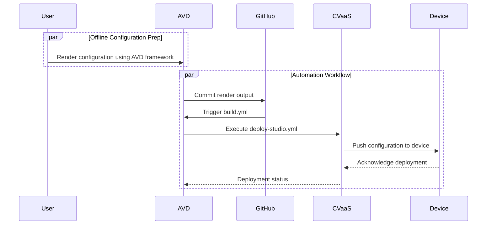

# Automation Workflow

## Table of Contents

- [Automation Workflow](#automation-workflow)
  - [Table of Contents](#table-of-contents)
  - [AVD Workflow Overview](#avd-workflow-overview)
  - [Inventory Structure](#inventory-structure)
  - [Build Playbook](#build-playbook)

## AVD Workflow Overview

This document outlines the workflow for using Arista Ansible Validated Designs (AVD) to automate and deploy network configurations to EOS devices via CloudVision as-a-Service (CVaaS).



## Inventory Structure

The following is the recommended Ansible file structure for an Arista Validated Design (AVD) campus deployment. This layout ensures that device-specific variables, group variables, and playbooks are organized for both clarity and scalability.

```bash
project_root/
├── inventory.yml              # Primary inventory file listing all devices and groups in the lab/fabric.
├── group_vars/                # Directory containing variables applied to device groups.
│   ├── all.yml                # Global variables applied to all devices, e.g., NTP, logging, common VLANs.
│   ├── <group>.yml            # Group-specific variables for a subset of devices (e.g., LEAF, SPINE).
├── host_vars/                 # Directory containing device-specific configuration variables.
│   └── <device-hostname>.yml  # Host-level variables overriding group/global defaults (e.g., loopback IP, mgmt interface).
├── build.yml                  # Playbook to render structured configurations from templates using inventory data.
├── deploy.yml                 # Playbook to push the rendered configurations to devices via CVaaS or directly via EOS API.
└── ansible.cfg                # Ansible configuration file. Specifies inventory location, connection settings, and AVD-specific options.
```

<!-- #TODO: Copy code for playbooks - Build -->
## Build Playbook

The build.yml playbook is responsible for generating both structured AVD configurations and device-specific CLI-ready configurations. It leverages two core AVD roles: eos_designs and eos_cli_config_gen.

```yaml
- name: Build Configs
  hosts: CAMPUS
  gather_facts: false
  tasks:

    - name: Generate AVD Structured Configurations and Fabric Documentation
      ansible.builtin.import_role:
        name: arista.avd.eos_designs
      vars:
        fabric_dir_name: 'fabric'
        fabric_dir: '{{ playbook_dir }}/docs/documentation/{{ fabric_dir_name }}'

    - name: Generate Device Configurations and Documentation
      ansible.builtin.import_role:
        name: arista.avd.eos_cli_config_gen
      vars:
        devices_dir_name: 'devices'
        devices_dir: '{{ playbook_dir }}/docs/documentation/{{ devices_dir_name }}'
```

**`arista.avd.eos_designs`**


Purpose:
Generates structured configuration data models from your inventory (`inventory.yml`, `group_vars`, `host_vars`) and produces fabric-wide documentation.

**Outputs:**

```yaml
vars:
  fabric_dir_name: 'fabric'
  fabric_dir: '{{ playbook_dir }}/docs/documentation/{{ fabric_dir_name }}'
```

- YAML device data under `structured_configs/`
- Markdown documentation rended under GIT paged directory `/docs/documentation/fabric/`

**Includes:**

- Interface assignments
- BGP/EVPN design and settings
- VLAN and SVI definitions
- Underlay and overlay routing logic


<!-- #TODO: Copy code for playbooks - Deploy -->

<!-- #TODO: Add CV - Studio Workspace Validation -->

<!-- #TODO: Add CV - change ticket provess -->

<!-- #TODO: Add CV - conclusion -->

<!-- #TODO: copy reference code -->
