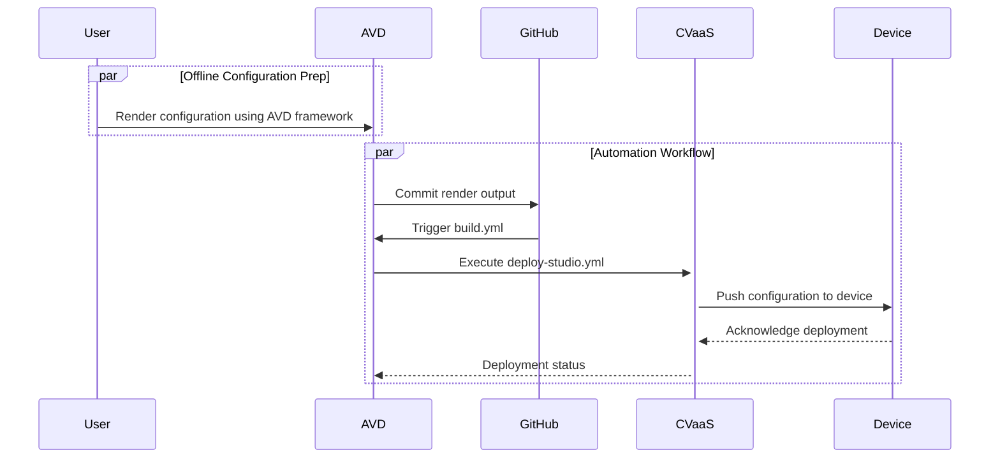

# Automation Workflow

This workflow demonstrates how AVD integrates with GitHub Actions and CVaaS for automated configuration deployment.

```mermaid
sequenceDiagram
  participant User
  participant AVD
  participant GH as GitHub
  participant CVaaS
  participant Device
  
  par Offline Configuration Prep
    User->>AVD: Render configuration using AVD framework
  end
  par Automation Workflow
    AVD->>GH: Commit render output
    GH->>AVD: Trigger build.yml
    AVD->>+CVaaS: Execute deploy-studio.yml
    CVaaS->>Device: Push configuration to device
    Device-->>CVaaS: Acknowledge deployment
    CVaaS-->>AVD: Deployment status
  end
```