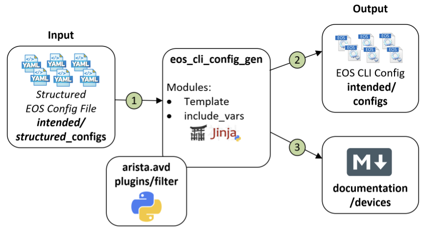

# Automation Workflow

## Table of Contents

- [Automation Workflow](#automation-workflow)
  - [Table of Contents](#table-of-contents)
  - [AVD Workflow Overview](#avd-workflow-overview)
  - [Inventory Structure](#inventory-structure)
  - [Build Playbook](#build-playbook)
    - [**`arista.avd.eos_designs`**](#aristaavdeos_designs)
    - [**`arista.avd.eos_cli_config_gen`**](#aristaavdeos_cli_config_gen)
    - [How the Roles Work Together](#how-the-roles-work-together)
    - [Key Concept](#key-concept)
    - [Example Output build.yml](#example-output-buildyml)
  - [Deploy Playbook](#deploy-playbook)
    - [**`arista.avd.cv_deploy`**](#aristaavdcv_deploy)
    - [Role Workflow](#role-workflow)
    - [Example Output deploy-studio.yml](#example-output-deploy-studioyml)

## AVD Workflow Overview

This document outlines the workflow for using Arista Ansible Validated Designs (AVD) to automate and deploy network configurations to EOS devices via CloudVision as-a-Service (CVaaS).


## Inventory Structure

The following is the recommended Ansible file structure for an Arista Validated Design (AVD) campus deployment. This layout ensures that device-specific variables, group variables, and playbooks are organized for both clarity and scalability.

```bash
project_root/
├── inventory.yml              # Primary inventory file listing all devices and groups in the lab/fabric.
├── group_vars/                # Directory containing variables applied to device groups.
│   ├── all.yml                # Global variables applied to all devices, e.g., NTP, logging, common VLANs.
│   ├── <group>.yml            # Group-specific variables for a subset of devices (e.g., LEAF, SPINE).
├── host_vars/                 # Directory containing device-specific configuration variables.
│   └── <device-hostname>.yml  # Host-level variables overriding group/global defaults (e.g., loopback IP, mgmt interface).
├── build.yml                  # Playbook to render structured configurations from templates using inventory data.
├── deploy.yml                 # Playbook to push the rendered configurations to devices via CVaaS or directly via EOS API.
└── ansible.cfg                # Ansible configuration file. Specifies inventory location, connection settings, and AVD-specific options.
```

<!-- #TODO: Copy code for playbooks - Build -->
## Build Playbook

The build.yml playbook is responsible for generating both structured AVD configurations and device-specific CLI-ready configurations. It leverages two core AVD roles: eos_designs and eos_cli_config_gen.

```yaml
- name: Build Configs
  hosts: CAMPUS
  gather_facts: false
  tasks:

    - name: Generate AVD Structured Configurations and Fabric Documentation
      ansible.builtin.import_role:
        name: arista.avd.eos_designs
      vars:
        fabric_dir_name: 'fabric'
        fabric_dir: '{{ playbook_dir }}/docs/documentation/{{ fabric_dir_name }}'

    - name: Generate Device Configurations and Documentation
      ansible.builtin.import_role:
        name: arista.avd.eos_cli_config_gen
      vars:
        devices_dir_name: 'devices'
        devices_dir: '{{ playbook_dir }}/docs/documentation/{{ devices_dir_name }}'
```

### **`arista.avd.eos_designs`**


**Purpose:**

Generates structured configuration data models from your inventory (`inventory.yml`, `group_vars`, `host_vars`) and produces fabric-wide documentation.

**Outputs:**

1. Markdown Documentation

    - Markdown documentation rended under GIT pages directory `/docs/documentation/fabric/`

    ```yaml
    vars:
      fabric_dir_name: 'fabric'
      fabric_dir: '{{ playbook_dir }}/docs/documentation/{{ fabric_dir_name }}'
    ```

2. Structured Configuration Data

    - YAML device data under `structured_configs/`

**Includes:**

- Interface assignments
- BGP/EVPN design and settings
- VLAN and SVI definitions
- Underlay and overlay routing logic

### **`arista.avd.eos_cli_config_gen`**



**Purpose:**

Transforms the structured configuration output from eos_designs into CLI-ready EOS configurations using Jinja2 templates.

**Outputs:**

- Flat text configuration files per device in intended/configs/
- Structured configs for CVP Studio in intended/structured_configs/
- Device documentation rended under GIT pages directory `/docs/documentation/fabric/`

```yaml
vars:
  devices_dir_name: 'devices'
  devices_dir: '{{ playbook_dir }}/docs/documentation/{{ devices_dir_name }}'
```

**Includes:**

- Complete running-config per device
- Platform-specific syntax (MLAG, port-channel, BGP, etc.)
- Configurations ready for EOS or CVaaS deployment

### How the Roles Work Together

- `eos_designs:` Defines what the network should do — processes inventory, computes interface IPs, routing, VLANs, and fabric topology, and exports structured YAML data.
- `eos_cli_config_gen:` Defines how to implement it — reads structured YAML data, renders CLI syntax using Jinja2 templates, and produces device-ready configuration files.

### Key Concept

| **Role**             | **Function**                                                  |
| -------------------- | ------------------------------------------------------------- |
| `eos_designs`        | "What should this network do?" (design intent)                |
| `eos_cli_config_gen` | "What CLI is needed to implement it?" (device implementation) |

### Example Output build.yml

```bash
(venv) $ ansible-playbook -i inventory.yml build.yml 

PLAY [Build Configs] ************************************************************************************************

TASK [arista.avd.eos_designs : Verify Requirements] *********************************************************************************************************************
AVD version 5.4.0
Use -v for details.
ok: [SC-B1-Core1 -> localhost]

TASK [arista.avd.eos_designs : Create required output directories if not present] *********************************************************************************************************************
ok: [SC-B1-Core1 -> localhost] => (item=/path/to/intended/structured_configs)
changed: [SC-B1-Core1 -> localhost] => (item=/path/to/docs/documentation/fabric)

TASK [arista.avd.eos_designs : Set eos_designs facts] *********************************************************************************************************************
ok: [SC-B1-Core1]

TASK [arista.avd.eos_designs : Generate device configuration in structured format] *********************************************************************************************************************
ok: [SC-B1-Core1 -> localhost]
ok: [SC-B1-Core2 -> localhost]
ok: [SC-B1-IDF1 -> localhost]

TASK [arista.avd.eos_designs : Generate fabric documentation] *********************************************************************************************************************
ok: [SC-B1-Core1 -> localhost]

TASK [arista.avd.eos_designs : Remove avd_switch_facts] *********************************************************************************************************************
ok: [SC-B1-Core1]

TASK [arista.avd.eos_cli_config_gen : Verify Requirements] *********************************************************************************************************************
skipping: [SC-B1-Core1]

TASK [arista.avd.eos_cli_config_gen : Generate eos intended configuration and device documentation] *********************************************************************************************************************
ok: [SC-B1-IDF1 -> localhost]
ok: [SC-B1-Core2 -> localhost]
ok: [SC-B1-Core1 -> localhost]

PLAY RECAP **********************************************************************************************************
SC-B1-Core1                : ok=7    changed=1    unreachable=0    failed=0    skipped=1    rescued=0    ignored=0   
SC-B1-Core2                : ok=2    changed=0    unreachable=0    failed=0    skipped=0    rescued=0    ignored=0   
SC-B1-IDF1                 : ok=2    changed=0    unreachable=0    failed=0    skipped=0    rescued=0    ignored=0 
```

<!-- #TODO: Copy code for playbooks - Deploy -->
## Deploy Playbook

The deploy-studio.yml playbook uses the arista.avd.cv_deploy role to upload device configurations to CloudVision as-a-Service (CVaaS) or CloudVision Portal (CVP).

```yaml
---
# deploy-studio.yml
- name: Deploy Configurations to Devices Using CloudVision Portal # (1)!
  hosts: CAMPUS
  gather_facts: false
  connection: local
  tasks:
    - name: Push Configuration to CVaaS Studio
      ansible.builtin.import_role:
        name: arista.avd.cv_deploy
```

### **`arista.avd.cv_deploy`**


**Purpose:**

The cv_deploy role automates deployment of generated EOS configurations to CloudVision.
It connects to CVaaS using an API token and uploads configurations as Studio Configlets, ready for review and activation.

**Key Functions:**

- Uploads intended configurations from intended/configs/
- Synchronizes devices and configuration assignments in CVaaS
- Supports Config Studio mode for pre-change proposals
- Handles tagging, provisioning, and verification tasks
- Optionally triggers Studio proposals for change control workflows

### Role Workflow

`cv_deploy` executes the following workflow:

- Reads intended configurations from intended/configs/
- Authenticates to CVaaS via cv_server and cv_token
- Creates or updates Configlets in CloudVision Studio
- Assigns Configlets to corresponding devices
- Optionally initiates proposals for review and approval
- Validates assignments and provides execution summary

### Example Output deploy-studio.yml

```bash
(venv) # ansible-playbook -i inventory.yml deploy-studio.yml

PLAY [Deploy Configurations to Devices Using CloudVision Portal] **************************************

TASK [arista.avd.cv_deploy : Verify Requirements] *****************************************************
AVD version 5.4.0
Use -v for details.
ok: [SC-B1-Core1 -> localhost]

TASK [arista.avd.cv_deploy : Deploy device configurations and tags to CloudVision] ********************
changed: [SC-B1-Core1 -> localhost]

PLAY RECAP ********************************************************************************************
SC-B1-Core1   : ok=2    changed=1    unreachable=0    failed=0    skipped=0    rescued=0    ignored=0

```

<!-- #TODO: Add CV - Studio Workspace Validation -->

<!-- #TODO: Add CV - change ticket provess -->

<!-- #TODO: Add CV - conclusion -->

<!-- #TODO: copy reference code -->
