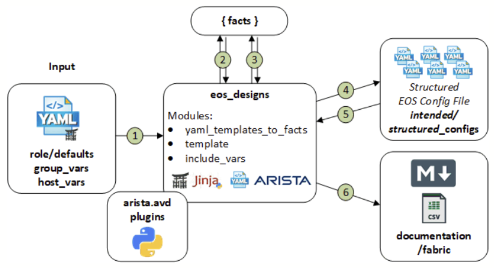
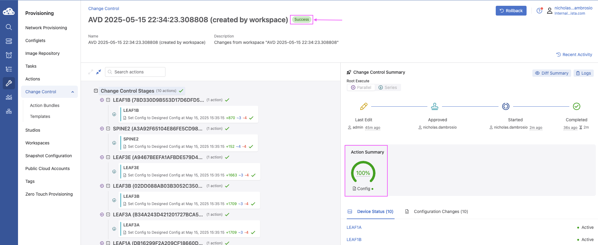

# Automation Workflow

## AVD Workflow Overview

This document outlines the workflow for using Arista Ansible Validated Designs (AVD) to automate and deploy network configurations to EOS devices via CloudVision as-a-Service (CVaaS).

<!-- revise workflow diagram -->


---

## Inventory Structure

The following is the recommended Ansible file structure for an Arista Validated Design (AVD) campus deployment. This layout ensures that device-specific variables, group variables, and playbooks are organized for both clarity and scalability.

```bash
project_root/
├── inventory.yml              # Primary inventory file listing all devices and groups in the lab/fabric.
├── group_vars/                # Directory containing variables applied to device groups.
│   ├── all.yml                # Global variables applied to all devices, e.g., NTP, logging, common VLANs.
│   ├── <group>.yml            # Group-specific variables for a subset of devices (e.g., LEAF, SPINE).
├── host_vars/                 # Directory containing device-specific configuration variables.
│   └── <device-hostname>.yml  # Host-level variables overriding group/global defaults (e.g., loopback IP, mgmt interface).
├── build.yml                  # Playbook to render structured configurations from templates using inventory data.
├── deploy.yml                 # Playbook to push the rendered configurations to devices via CVaaS or directly via EOS API.
└── ansible.cfg                # Ansible configuration file. Specifies inventory location, connection settings, and AVD-specific options.
```

---

## Build Playbook

The build.yml playbook is responsible for generating both structured AVD configurations and device-specific CLI-ready configurations. It leverages two core AVD roles: eos_designs and eos_cli_config_gen.

```yaml
- name: Build Configs
  hosts: CAMPUS
  gather_facts: false
  tasks:

    - name: Generate AVD Structured Configurations and Fabric Documentation
      ansible.builtin.import_role:
        name: arista.avd.eos_designs
      vars:
        fabric_dir_name: 'fabric'
        fabric_dir: '{{ playbook_dir }}/docs/documentation/{{ fabric_dir_name }}'

    - name: Generate Device Configurations and Documentation
      ansible.builtin.import_role:
        name: arista.avd.eos_cli_config_gen
      vars:
        devices_dir_name: 'devices'
        devices_dir: '{{ playbook_dir }}/docs/documentation/{{ devices_dir_name }}'
```

---

### **`arista.avd.eos_designs`**



**Purpose:**

Generates structured configuration data models from your inventory (`inventory.yml`, `group_vars`, `host_vars`) and produces fabric-wide documentation.

**Outputs:**

1. Markdown Documentation

    - Markdown documentation rended under GIT pages directory `/docs/documentation/fabric/`

    ```yaml
    vars:
      fabric_dir_name: 'fabric'
      fabric_dir: '{{ playbook_dir }}/docs/documentation/{{ fabric_dir_name }}'
    ```

2. Structured Configuration Data

    - YAML device data under `structured_configs/`

**Includes:**

- Interface assignments
- BGP/EVPN design and settings
- VLAN and SVI definitions
- Underlay and overlay routing logic

---


### **`arista.avd.eos_cli_config_gen`**


**Purpose:**

Transforms the structured configuration output from eos_designs into CLI-ready EOS configurations using Jinja2 templates.

**Outputs:**

- Flat text configuration files per device in intended/configs/
- Structured configs for CVP Studio in intended/structured_configs/
- Device documentation rended under GIT pages directory `/docs/documentation/fabric/`

```yaml
vars:
  devices_dir_name: 'devices'
  devices_dir: '{{ playbook_dir }}/docs/documentation/{{ devices_dir_name }}'
```

**Includes:**

- Complete running-config per device
- Platform-specific syntax (MLAG, port-channel, BGP, etc.)
- Configurations ready for EOS or CVaaS deployment

---

### How the Roles Work Together

- `eos_designs:` Defines what the network should do — processes inventory, computes interface IPs, routing, VLANs, and fabric topology, and exports structured YAML data.
- `eos_cli_config_gen:` Defines how to implement it — reads structured YAML data, renders CLI syntax using Jinja2 templates, and produces device-ready configuration files.

---

### Key Concept

| **Role**             | **Function**                                                  |
| -------------------- | ------------------------------------------------------------- |
| `eos_designs`        | "What should this network do?" (design intent)                |
| `eos_cli_config_gen` | "What CLI is needed to implement it?" (device implementation) |

---

### Example Output build.yml

```bash
(venv) $ ansible-playbook -i inventory.yml build.yml 

PLAY [Build Configs] ************************************************************************************************

TASK [arista.avd.eos_designs : Verify Requirements] *********************************************************************************************************************
AVD version 5.4.0
Use -v for details.
ok: [SC-B1-Core1 -> localhost]

TASK [arista.avd.eos_designs : Create required output directories if not present] *********************************************************************************************************************
ok: [SC-B1-Core1 -> localhost] => (item=/path/to/intended/structured_configs)
changed: [SC-B1-Core1 -> localhost] => (item=/path/to/docs/documentation/fabric)

TASK [arista.avd.eos_designs : Set eos_designs facts] *********************************************************************************************************************
ok: [SC-B1-Core1]

TASK [arista.avd.eos_designs : Generate device configuration in structured format] *********************************************************************************************************************
ok: [SC-B1-Core1 -> localhost]
ok: [SC-B1-Core2 -> localhost]
ok: [SC-B1-IDF1 -> localhost]

TASK [arista.avd.eos_designs : Generate fabric documentation] *********************************************************************************************************************
ok: [SC-B1-Core1 -> localhost]

TASK [arista.avd.eos_designs : Remove avd_switch_facts] *********************************************************************************************************************
ok: [SC-B1-Core1]

TASK [arista.avd.eos_cli_config_gen : Verify Requirements] *********************************************************************************************************************
skipping: [SC-B1-Core1]

TASK [arista.avd.eos_cli_config_gen : Generate eos intended configuration and device documentation] *********************************************************************************************************************
ok: [SC-B1-IDF1 -> localhost]
ok: [SC-B1-Core2 -> localhost]
ok: [SC-B1-Core1 -> localhost]

PLAY RECAP **********************************************************************************************************
SC-B1-Core1                : ok=7    changed=1    unreachable=0    failed=0    skipped=1    rescued=0    ignored=0   
SC-B1-Core2                : ok=2    changed=0    unreachable=0    failed=0    skipped=0    rescued=0    ignored=0   
SC-B1-IDF1                 : ok=2    changed=0    unreachable=0    failed=0    skipped=0    rescued=0    ignored=0 
```

---

## Deploy Playbook

The deploy-studio.yml playbook uses the arista.avd.cv_deploy role to upload device configurations to CloudVision as-a-Service (CVaaS) or CloudVision Portal (CVP).

```yaml
---
# deploy-studio.yml
- name: Deploy Configurations to Devices Using CloudVision Portal # (1)!
  hosts: CAMPUS
  gather_facts: false
  connection: local
  tasks:
    - name: Push Configuration to CVaaS Studio
      ansible.builtin.import_role:
        name: arista.avd.cv_deploy
```

---

### **`arista.avd.cv_deploy`**


**Purpose:**

The cv_deploy role automates deployment of generated EOS configurations to CloudVision.
It connects to CVaaS using an API token and uploads configurations as Studio Configlets, ready for review and activation.

**Key Functions:**

- Uploads intended configurations from intended/configs/
- Synchronizes devices and configuration assignments in CVaaS
- Supports Config Studio mode for pre-change proposals
- Handles tagging, provisioning, and verification tasks
- Optionally triggers Studio proposals for change control workflows

---

### Role Workflow

`cv_deploy` executes the following workflow:

- Reads intended configurations from intended/configs/
- Authenticates using the inventory file
  
    ```yaml
    cv_inventory_hostname: "cvaas"
    ```

- Creates or updates Configlets in CloudVision Studio
- Assigns Configlets to corresponding devices
- Optionally initiates proposals for review and approval
- Validates assignments and provides execution summary

---

### Summary

| Role                       | Function                                          | Output Directory            | Purpose                                                       |
| -------------------------- | ------------------------------------------------- | --------------------------- | ------------------------------------------------------------- |
| **`arista.avd.cv_deploy`** | Deploys device configurations to CVaaS/CVP Studio | `intended/configs/` → CVaaS | Automates configuration publishing and device synchronization |

---

### Example Output deploy-studio.yml

```bash
(venv) # ansible-playbook -i inventory.yml deploy-studio.yml

PLAY [Deploy Configurations to Devices Using CloudVision Portal] **************************************

TASK [arista.avd.cv_deploy : Verify Requirements] *****************************************************
AVD version 5.4.0
Use -v for details.
ok: [SC-B1-Core1 -> localhost]

TASK [arista.avd.cv_deploy : Deploy device configurations and tags to CloudVision] ********************
changed: [SC-B1-Core1 -> localhost]

PLAY RECAP ********************************************************************************************
SC-B1-Core1   : ok=2    changed=1    unreachable=0    failed=0    skipped=0    rescued=0    ignored=0
```

---

## Submit Pending Change Control via CloudVision as-a-Service (CVaaS)

Once configurations have been deployed using the `deploy-studio.yml` playbook, CloudVision automatically generates a **Studio workspace** and corresponding **Change Control (CC)** proposal for operator review. This workflow ensures that all device changes follow a consistent approval and execution process directly from the CVaaS interface.

---

### :compass: Review the Studio Workspace {#review-the-studio-workspace}

After deployment:

1. A new **Studio Workspace** is automatically created in CVaaS.
2. Each device’s **intended configuration** is visible and version-controlled.
3. Differences between the **current** and **intended** running configurations are displayed in the diff viewer.
4. CVaaS validates configuration syntax and highlights any merge conflicts before submission.

This provides a full audit trail of configuration changes — making it easy to trace updates, rollback, or troubleshoot deployment logic.


---

### :memo: Review Pending Change Control {#review-pending-change-control}

Once the workspace is validated, CVaaS automatically generates a **Pending Change Control** request. This represents the set of configuration changes that will be applied to managed devices once approved.

Within the **Change Control** view, operators can:

- Review the **scope of devices** impacted  
- Validate **configuration differences**  
- Confirm **pre-check validations** (e.g., reachability, syntax, compliance)  
- Ensure **dependencies** or **sequences** are properly handled


---

### :rocket: Approve and Execute the Change Control {#approve-and-execute-the-change-control}

When the pending Change Control has been reviewed and validated:

1. Click the **pending change ticket** in CVaaS  
2. Review the proposed changes in the diff viewer  
3. Click **“Approve and Execute”** when ready to proceed  

CVaaS will then push the intended configurations to all targeted devices in the fabric.  
During execution, CloudVision performs automatic validation, monitors deployment progress, and provides detailed logs per device.


---

### :white_check_mark: Post-Execution Validation {#post-execution-validation}

Once the Change Control completes successfully:

- The workspace will be marked as **“Executed”**  
- All assigned devices reflect the **new intended state**  
- The execution report provides timestamps, status per device, and operator attribution  

This process ensures full visibility, traceability, and compliance for every change deployed through CVaaS.



## Conclusion

This workflow demonstrates a complete end-to-end process for deploying and managing a campus fabric using **Arista AVD** and **CloudVision as-a-Service (CVaaS)**:

- **Inventory Validation:** Ensures that your Ansible inventory is correctly structured with device, VRF, and VLAN definitions.
- **Build Configurations:** Generates structured configuration data and CLI-ready EOS configurations using the `eos_designs` and `eos_cli_config_gen` roles.
- **Deploy Configurations:** Pushes the rendered configurations to CVaaS Studio, creates workspaces, and generates pending change control tickets.
- **Change Control Execution:** Approves and executes configuration changes in the fabric with automated verification.
- **Documentation:** Maintains detailed, Markdown-based documentation for both fabric-level and device-level configurations.

Following this workflow ensures reproducible, validated, and auditable network configuration deployments, reducing manual errors and operational overhead.

---

## References

### Getting Started

- [Install Arista AVD](https://avd.arista.com/5.4/docs/installation/collection-installation.html) – Step-by-step installation instructions.
- [Getting Started Guide](https://avd.arista.com/5.4/docs/getting-started/intro-to-ansible-and-avd.html) – Intro to Ansible and AVD concepts.
- [Campus Fabric Example](https://avd.arista.com/5.4/ansible_collections/arista/avd/examples/campus-fabric/index.html) – Example configuration for a campus network fabric.

### Arista AVD Roles

- [eos_designs](https://avd.arista.com/5.4/ansible_collections/arista/avd/roles/eos_designs/index.html) – Generates structured configs and fabric documentation.
- [eos_cli_config_gen](https://avd.arista.com/5.4/ansible_collections/arista/avd/roles/eos_cli_config_gen/index.html) – Converts structured configs to EOS CLI configurations.
- [cv_deploy](https://avd.arista.com/5.4/ansible_collections/arista/avd/roles/cv_deploy/index.html) – Pushes configurations to CVaaS Studio.

### Additional Resources

- [Arista NetDevOps Community](https://github.com/arista-netdevops-community) – Community projects and discussions.
- [Arista AVD Documentation](https://avd.arista.com/5.4/index.html) – Comprehensive AVD reference.
- [Ansible Galaxy: arista.avd](https://galaxy.ansible.com/ui/repo/published/arista/avd/) – Collection download and role documentation.
- [Arista ANTA Framework](https://anta.arista.com/stable/) – Automated Network Test Automation framework.
- [Arista PyAVD](https://avd.arista.com/5.4/docs/pyavd/pyavd.html) – Python library for generating AVD structured data.
